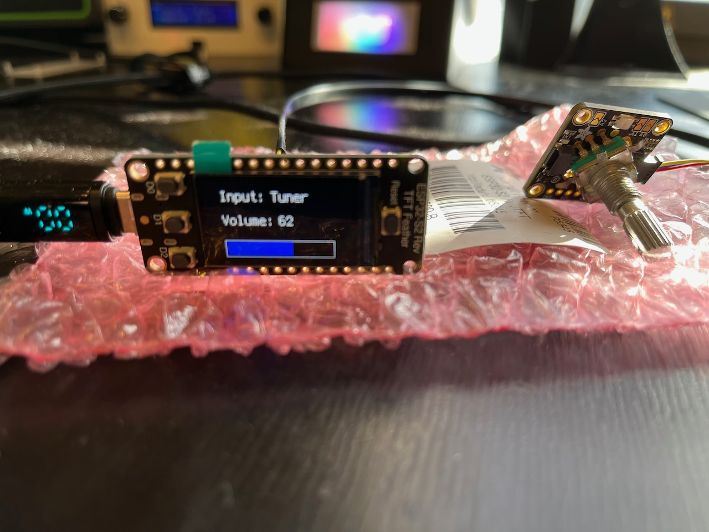

# circuitpython-denon-remote-control
A remote control for Denon receivers using an Adafruit Reverse TFT ESP32-S2 and CircuitPython

## Overview

This program uses CircuitPython to remotely control a Denon audio-video receiver using a combination of serial and XML commands over the network.

I have programmed the 3 Reverse-TFT buttons on the left to change Zone 2 sources:
* CD (AUX1)
* TUNER
* Vinyl (CD)

Note I have customized the names of my sources, with my name first and the receiver's version of the source second.  These are the three most used sources for me, but you could customize them to your favorite sources or even a list of sources and cycle through the list using one or two of the buttons.

The rotary encoder on the right controls the volume and pushing the button mutes or unmutes the receiver.

Similar to my [Audioreactive Speaker Stand Lights](https://github.com/prcutler/speakerstand-lights) project, the Feather is meant to be mounted in a speaker stand.  Design is TBD and is a work in progress and will be included here when complete.

## Issues and Bugs
* After a period of inactivity, the program crashes after losing connection with the receiver
* The two XML calls take way too long to load and can cause an `out of sockets` error.

## Hardware Needed
* [Adafruit ESP32-S2 (or S3) Reverse TFT Feather](https://www.adafruit.com/product/5345)
* [Adafruit Stemma QT Rotary Encoder](https://www.adafruit.com/product/4991) and [rotary encoder](https://www.adafruit.com/product/377)
* StemmaQT cable
* 3D Printer - optional, but you probably want some way to mount the Feather

## Credits

* This project couldn't have been completed without the [`denonaavr` Python library](https://github.com/ol-iver/denonavr).  Everything I needed was well documented for the XML queries. Denon's serial control protocol is well documented, though there are far fewer Zone2 commands.
* BlitzcityDIY for her [Octoprint enclosure](https://www.printables.com/model/392357-circuitpython-octoprint-controller-and-monitor-cas) which also featured a square faceplate for the ESP32-S2 Reverse TFT Feather.
* Neradoc for porting [ElementTree](https://github.com/Neradoc/Circuitpython-ElementTree) to CircuitPython for parsing XML.
